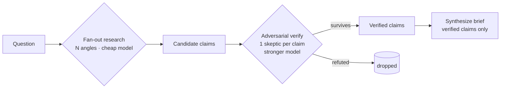

# multi-agent-research-pipeline

Turn a single research question into a **verified brief** by orchestrating several
LLM calls instead of trusting one big prompt.

A single LLM pass hallucinates and gives you no way to tell which parts to trust.
This small, dependency-light harness splits the work into three stages so weak
claims get filtered out **before** they reach the final answer — and tiers the
models by job so it stays fast and cheap.



## The idea

- **Fan-out** — ask several *angles* of the question in parallel (key facts, risks, common misconceptions, the contrarian view) so coverage isn't trapped in one framing.
- **Adversarial verify** — a *separate* model instance is told to **refute** each claim and defaults to rejecting when unsure. Plausible-but-wrong claims die here instead of in your final output.
- **Synthesize** — the brief is written from **verified claims only**, so it can't smuggle in facts that didn't survive checking.
- **Model tiering** — breadth runs on a cheap model; the judgement calls (verify, synthesis) run on a stronger one. Match the model to the job, not the other way around.

## Quickstart

```bash
pip install -r requirements.txt
cp .env.example .env            # then add your ANTHROPIC_API_KEY
python pipeline.py "Is nuclear power a good fit for powering data centers?"
```

The run prints how many candidate claims were gathered and how many survived
verification (to stderr), then prints the synthesized brief (to stdout).

## Configure

All knobs are environment variables — no code changes needed:

| Variable | Default | Purpose |
|---|---|---|
| `ANTHROPIC_API_KEY` | — | your API key |
| `MODEL_RESEARCH` | `claude-haiku-4-5-20251001` | cheap breadth stage |
| `MODEL_VERIFY` | `claude-sonnet-4-6` | skeptical judge |
| `MODEL_SYNTH` | `claude-sonnet-4-6` | final writer |
| `MAX_CONCURRENCY` | `6` | cap on parallel LLM calls |

## Extending

- **Other providers** — `complete()` is the only provider-specific function; swap it to target OpenAI, a local model, etc.
- **Ground it in sources** — add a retrieval/web-fetch tool to the research stage so claims are tied to live citations.
- **Higher-stakes verification** — replace the single skeptic with a panel and majority-vote (N independent refuters per claim).

## Why it's built this way

Adversarial verification and model tiering are two of the cheapest, highest-leverage
moves for making LLM output trustworthy and affordable without a human in the loop.
Letting a *different* instance attack each claim catches the confident-but-wrong
answers that single-pass prompting ships straight to the user; sending only the
survivors to a strong synthesis model keeps the final answer grounded.

## License

MIT — see [LICENSE](LICENSE).
